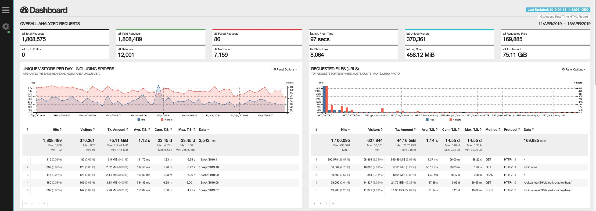

# Run GoAccess Tools for Your System Server



### 1. create local dir

```bash
$ mkdir -p /srv/goaccess/{data,html}
```

### 2. clone goaccess project

```bash
$ git clone https://github.com/allinurl/goaccess.git goaccess && cd $_
```

### 3. build docker image

```bash
$ docker build --squash --no-cache --tag=goaccess:latest .
```

### 4. run docker image

```bash
$ docker run --restart=always --name=goaccess -d -p 7890:7890 \
    -v "/srv/goaccess/data:/srv/data" \
    -v "/srv/goaccess/html:/srv/report" \
    -v "/var/log/apache2:/srv/logs" \
    goaccess:latest
```
