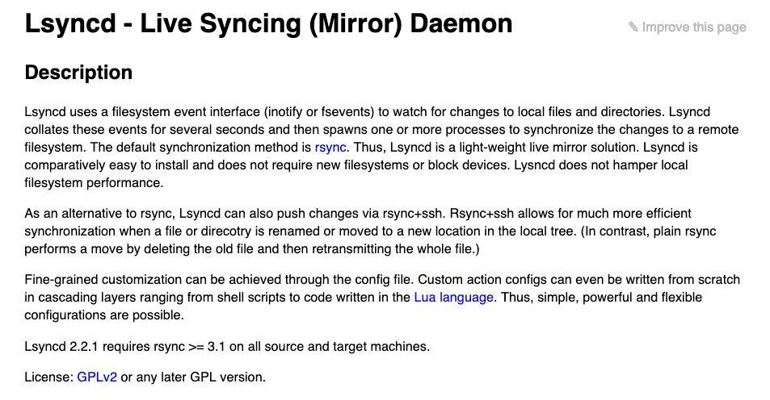

## Rsyncd Service Image

> **This image allow sync files between servers.**



### 1. run as master

> **Receive files from slave**

```bash
docker run -d --name=rsyncd_master \
    -v /data:/data \
    -p 873:873 \
    rsyncd [--password xxxxx]
```

### 2. run as slave

> **Send files to master**

Adjust inotify args

```bash
echo fs.inotify.max_user_watches=524288 | sudo tee -a /etc/sysctl.conf && sudo sysctl -p
```

Run

```bash
docker run -d --name=rsyncd_slave \
    -v /data:/data \
    rsyncd --slave \
    --ip master_ip \
    [--port 873] \
    [--limit 1000] \
    [--password xxxxx ] \
    [--dest /some_path ] \
    [--exclude /some/path/exclude] \
    [--delete]
```

### 3. parameter interpretation

> **The available parameters**

| number | parameter(=.=) | annotation |
| :----- | :----- | :----- |
| 1 | **`--ip`** | set master sync server ip or domain name.  |
| 2 | **`--port`** | master rsync domain service port, default is `873`. |
| 3 | **`--limit`** | limit socket I/O bandwidth. |
| 4 | **`--exclude`** | rsync exclude path. |
| 5 | **`--dest`** | the prefix of destination path in master side, default is `/`. |
| 6 | **`--password`** | set the password for rsync, default is `Zorx0jbMzgXD`. |
| 7 | **`--delay`** | rsync execute delay time, default is 15. |
| 8 | **`--delete`** | if you delete files in slave, the deleted files in master is not delete, set `--delete` could delete this files on master, default is false. |
| 9 | **`--debug`** | show debug message in container stdout |

### 4. usage example

> **Example is given to illustrate**

- **在master节点负责收集数据**
  - 将/data目录共享出去，收集slave节点发送的数据，然后进行本地存储
  - 设置密码为123456，主机地址为本机地址，使用端口号为默认的873端口
- **在slave节点负责向master节点发送数据**
  - 将本机的/data_app目录下的内容发送到master节点的/data/app_one_data目录进行存储
  - 参数中的--exclude是以共享的/data_app目录为根目录，参数中的--delete表示主从节点文件一致

```bash
# master
docker run -d --name=rsyncd_master \
    -v /data:/data \
    -p 873:873 \
    rsyncd:latest --password 123456

# slave
docker run -d --name=rsyncd_slave \
    -v /data_app:/data \
    rsyncd:latest --slave \
    --ip 192.168.1.100 \
    --port 873 \
    --password 123456 \
    --dest /app_one_data/ \
    --exclude /docker \
    --delete

# logs
docker logs -f rsyncd_master
docker logs -f rsyncd_slave
```

- **在master节点负责收集数据**
  - 将/data目录共享出去，收集slave节点发送的数据，然后进行本地存储
  - 密码为默认密码，主机地址为本机地址，使用端口号为默认的873端口
- **在slave节点负责向master节点发送数据**
  - 将本机的/app目录的内容发送到master节点的/data目录下进行存储，但是排除/app/pg_database/data目录
  - 将本机的/app/pg_database/data目录的内容发送到master节点的/data/pg_database/data目录下进行存储

```bash
# master
docker run -d --name=rsyncd_master \
    -v /data:/data \
    -p 873:873 \
    rsyncd:latest

# slave files data
docker run -d --name=rsyncd_slave \
    -v /app:/data \
    rsyncd:latest --slave \
    --ip 10.10.10.100 \
    --port 873 \
    --exclude=/pg_database/data \

# slave pg db
docker run -d --name=rsyncd_slave \
    -v /app/pg_database/data:/data \
    rsyncd:latest --slave \
    --ip 10.10.10.100 \
    --port 873 \
    --dest /pg_database/data
    --delete
```
