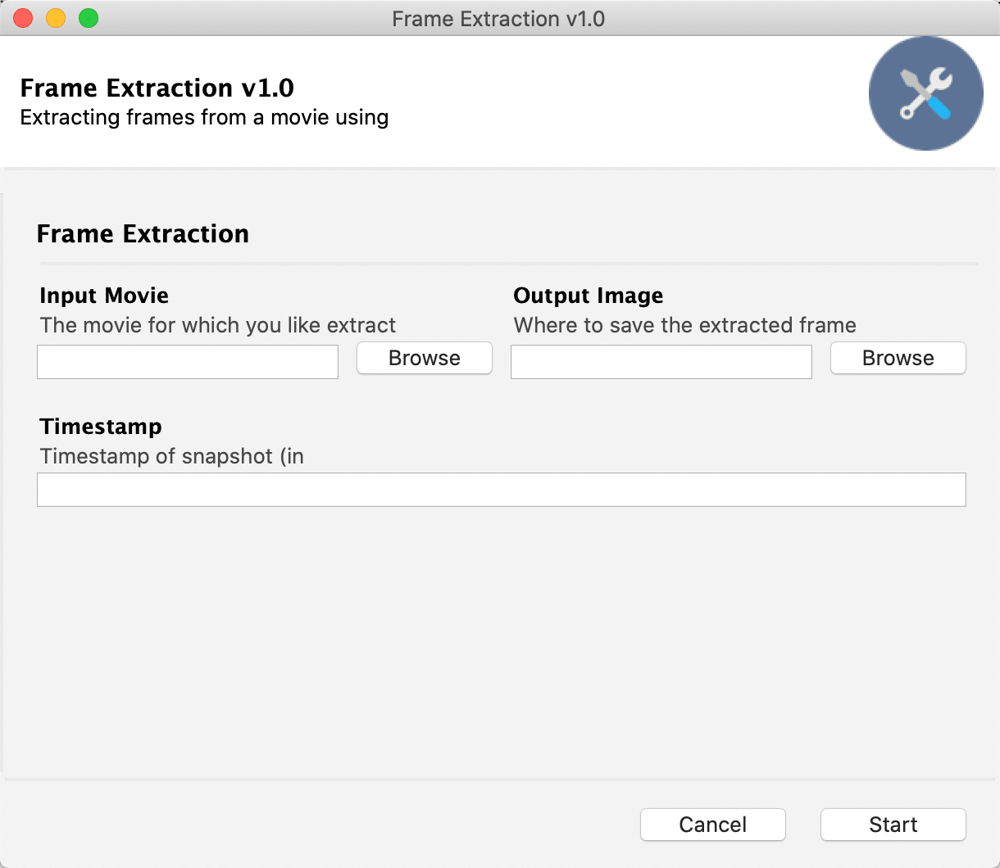

# Gooey

## 1. 命令行程序

```bash
# brew install ffmpeg
# https://github.com/chriskiehl/Gooey
ffmpeg -ss 300 -i /home/user/path/to/movie.mkv -frames:v 1 outfile.png
```

## 2. 程序运行截图

```bash
# run
➜ pythonw main.py
2019-12-30 13:57:37.598 Python[21981:459259] CoreText note: Client requested name ".SFNS-Regular", it will get Times-Roman rather than the intended font. All system UI font access should be through proper APIs such as CTFo
ntCreateUIFontForLanguage() or +[NSFont systemFontOfSize:].
2019-12-30 13:57:37.598 Python[21981:459259] CoreText note: Set a breakpoint on CTFontLogSystemFontNameRequest to debug.
```


