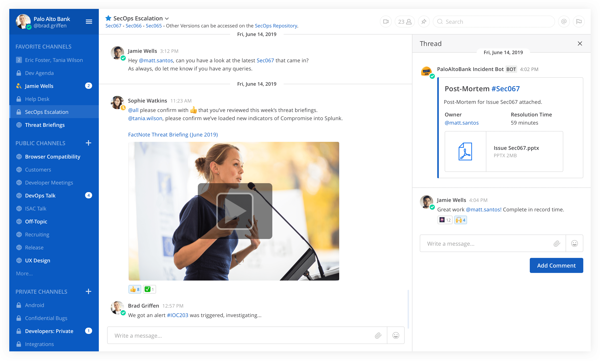
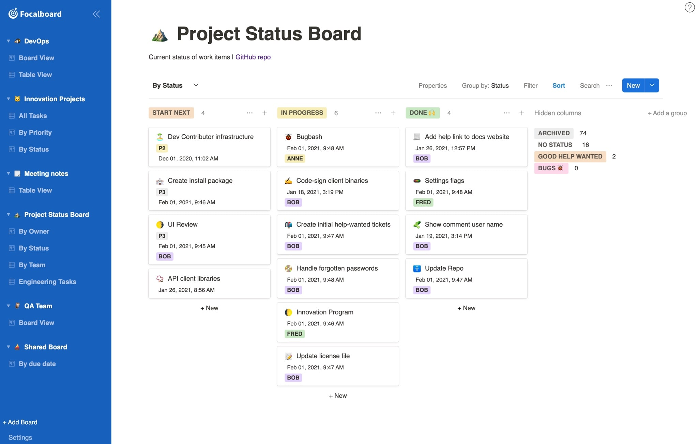

# Mattermost Org

---

## 1. Mattermost

> **团队协作工具 Slack 的开源替代品。**

[Mattermost](https://github.com/mattermost/mattermost-server) 是一款开源免费的团队协作工具，它是用 `Golang` 语音编译的，可配置 `MySQL` 或 `PostgreSQL` 数据库一同使用。每个月的 `16` 号都会有一个新的编译版本发布，可以算是目前来说比较理想的私有化部署方案了。

- [mattermost/mattermost-docker](https://github.com/mattermost/mattermost-docker)
- [mattermost/mattermost-prod-db](https://hub.docker.com/r/mattermost/mattermost-prod-db)
- [mattermost/mattermost-prod-app](https://hub.docker.com/r/mattermost/mattermost-prod-app)
- [mattermost/mattermost-prod-web](https://hub.docker.com/r/mattermost/mattermost-prod-web)



- **选择部署版本 - 企业版(`Enterprise`)/团队版(`Team`)**

```yaml
app:
  build:
    context: app
    args:
      - edition=team
```

```yaml
app:
  build:
    context: app
    args:
      - edition!=team
```

- **选择数据库类型 - `PostgreSQL`/`MySQL`/`AWS`**

```yaml
---
applications:
  - name: mattermost
    docker:
      image: mattermost/mattermost-prod-app
    instances: 1
    memory: 1G
    disk_quota: 256M
    env:
      DB_HOST: database host address
      DB_PORT_NUMBER: database port
      MM_DBNAME: database name
      MM_USERNAME: database username
      MM_PASSWORD: database password
```

- **启动运行服务 - Docker-Compose**

```bash
# 配置
$ mkdir -p ./volumes/app/mattermost/{data,logs,config,plugins}
$ chown -R 2000:2000 ./volumes/app/mattermost/

# 运行
docker-compose up -d
```

- **升级更新到最新版本 - latest**

```bash
# 关闭服务
$ docker-compose down

# 升级操作
git pull
docker-compose build

# 启动服务
docker-compose up -d
```

---

## 2. Focalboard

> **一个桌面的看板软件，可以用来管理待办事项。**

[Focalboard](https://nextcloud.com/) 是一款开源免费的待办事项看板管理软件，它有助于定义，组织，跟踪和管理个人和团队之间的工作。



- **手动编译 - Docker**

```bash
# 直接编译
$ docker build -t focalboard .

# 启动服务
$ docker run -it -p 80:8000 focalboard
```

- **一键部署 - Docker-Compose**

```bash
# 启动
# 需要配置反向代理服务
$ docker-compose up -d
```
