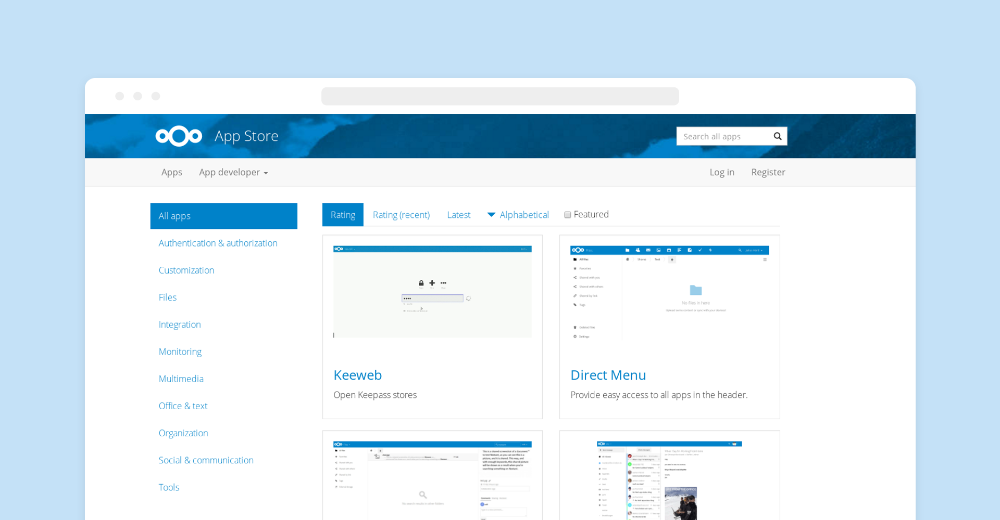

# Nextcloud

> **一款开源免费的私有云存储网盘项目**

---

[Nextcloud](https://nextcloud.com/) 是一款开源免费的私有云存储网盘项目，可以让你快速便捷地搭建一套属于自己或团队的云同步网盘，从而实现跨平台跨设备文件同步、共享、版本控制、团队协作等功能。它的客户端覆盖了 `Windows`、`Mac`、`Android`、`iOS`、`Linux` 等各种平台，也提供了网页端以及 `WebDAV` 接口，所以你几乎可以在各种设备上方便地访问你的云盘。

- Markdown在线编辑
- OnlyOffice
- 思维导图
- 日历和联系人管理
- RSS阅读器
- 工作流管理
- 可透过WebDAV访问
- 外部存储与安全加密
- 移动和桌面客户端

`NextCloud` 源代码完全开放，任何个人或企业都可以自由获取并在开源许可协议的约束下免费使用，对于需要专业支持的用户可以购买 `NextCloud` 官方的专业版订阅服务。
