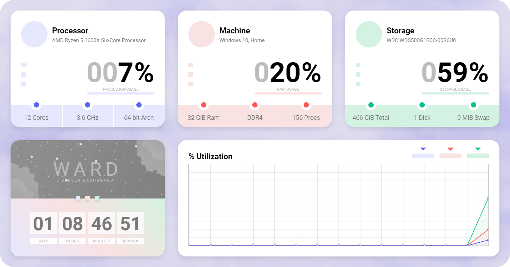

# Ward

> **简单和极简的服务器仪表盘**



---

[Ward](https://github.com/B-Software/Ward) 是一个简单而简约的服务器监视工具，主要包括本机操作系统和硬件信息。

- 支持自适应设计系统且支持深色主题
- 只显示操作系统最为基本且重要的信息

```bash
# Build for Docker
1. git clone https://github.com/B-Software/Ward.git; cd Ward
2. mvn clean package
3. docker build --squash --no-cache --tag ward:latest .
4. docker run --rm -it --name ward -p 8000:80 ward
5. Go to localhost:8000 in web browser
```

- **Processor**

| Processor name | [](https://camo.githubusercontent.com/3698437a841151fd03ec96819186b81884c96b9d/68747470733a2f2f737465616d75736572696d616765732d612e616b616d616968642e6e65742f7567632f313138333833313634333835313238323336302f343033464445424643463744314646304636394542353237384136314434453230383435444237412f) |
| ----- | ----- |
| Processor utilization percentage | |
| Processor cores count (Logical and physical ones) | |
| Maximum frequency of the processor | |
| Does the processor supports 64-bit instructions | |

- **Machine**

| Type of operating system and it's version | [](https://camo.githubusercontent.com/e24c20ea3d2a4f9a40d8470a4f115a4fb7f9871a/68747470733a2f2f737465616d75736572696d616765732d612e616b616d616968642e6e65742f7567632f313138333833313634333835313238353739362f313434424237343437313830364631324537343243443832463846463237353646333045343638332f) |
| ----- | ----- |
| RAM utilization percentage | |
| Amount of total installed RAM | |
| Generation of the installed RAM | |
| Current processes count | |

- **Storage**

| Host0 storage name | [](https://camo.githubusercontent.com/414c8071df24cf153da85158ab8f7888a6be0fd8/68747470733a2f2f737465616d75736572696d616765732d612e616b616d616968642e6e65742f7567632f313138333833313634333835313238393631362f413031353534313733424337384335414630333035373346383537324235334530304346354546442f) |
| ----- | ----- |
| Storage utilization percentage | |
| Total Storage installed (Including external drives) | |
| Installed disks count | |
| Total amount of virtual memory (Swap in Linux) | |
