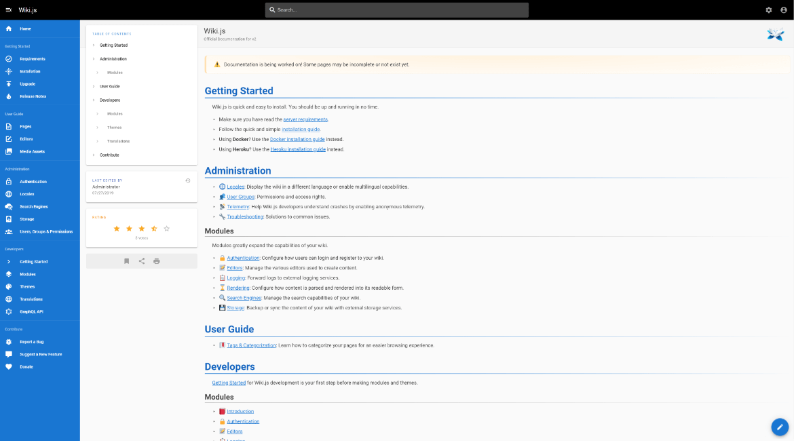

# Wiki.js

> **私有化部署Wiki服务系统**

---

很多时候, 我们都需要一个文档管理系统(`Wiki`)，但是市面上常见的开源解决方案，大多是类似 `GitBook` 这样依靠 `Git` 仓库来维护文档的管理。但是 `Wiki` 不同于纯电子书，需要很多在线编辑的场景，很需要一个在线编辑功能支持的，类似于 `tower`/`teambition`，但比其轻量级。而 `Wiki.js` 不仅能够满足上述需求，其技术栈新，`UI` 还挺漂亮，成为我们的不二之选！关于其功能更多的介绍和使用，请参考下面文档。

- [官方文档](https://github.com/Requarks/wiki)
- [用Wiki.js来优雅的管理文档](https://www.imbajin.com/2019-11-26-%E7%94%A8Wiki.js%E6%9D%A5%E4%BC%98%E9%9B%85%E7%9A%84%E7%AE%A1%E7%90%86%E6%96%87%E6%A1%A3/)
