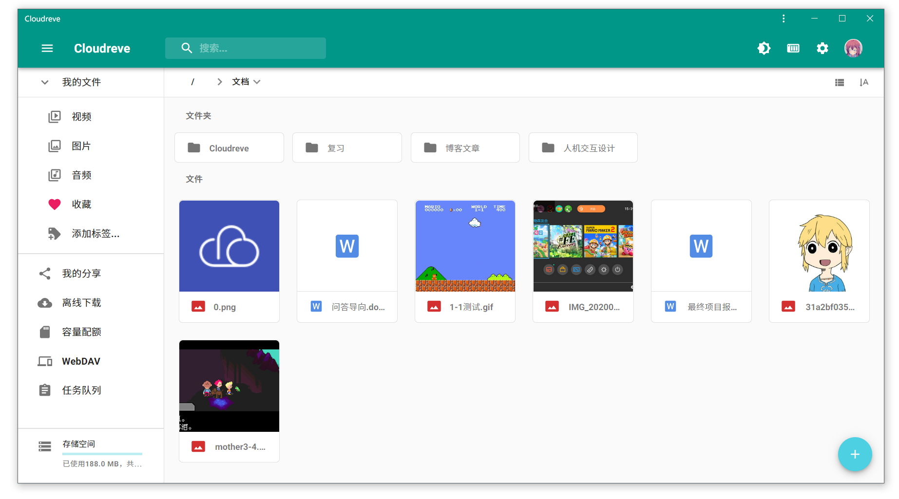

# Cloudreve使用说明



## 1. 快速开始

- 根据系统架构的不同，在 `GitHub Release` 页面获取已经构建打包完成的主程序，然后通过本项目的 `Dockerfile` 文件进行本地打包。

```bash
# 本地打包镜像
$ docker build --squash --no-cache --tag=cloudreve:0.0.1 .
```

## 2. 使用方式

- `Cloudreve` 在首次启动时，会创建初始管理员账号，请注意保管管理员密码，此密码只会在首次启动时出现。如果您忘记初始管理员密码，需要删除数据库目录，重新启动主程序以初始化新的管理员账户。修改了默认的 `Cloudreve` 服务的配置文件，设置默认会监听 `80` 端口。之后，使用 `docker-compose.yml` 启动服务，就可以在浏览器中访问 `http://服务器IP:80` 进入了。

```bash
# 单独启动启动(数据库使用SQLite)
$ docker run -d -p 80:80 --name cloudreve \
    -e TZ="Asia/Shanghai" \
    -v ./cloudreve/logs:/data/logs \
    -v ./cloudreve/uploads:/data/uploads \
    -v ./cloudreve/db:/data/cloudreve.db \
    cloudreve:0.0.1

# 使用docker-compose启动服务(数据库使用MySQL)
$ docker-compose -f ./docker/compose/docker-compose.yml up -d
```

## 3. 补充说明

- 在自用或者小规模使用的场景下，完全可以使用 `Cloudreve` 内置的 `Web` 服务器。但是如果你需要使用 `HTTPS` 的话，亦或是需要与服务器上其他 `Web` 服务共存时，你可能需要使用主流 `Web` 服务器反向代理 `Cloudreve`，以获得更丰富的扩展功能。

## 4. 参考地址

- [官方Github参考](https://github.com/cloudreve/Cloudreve)
- [官方使用文档地址](https://docs.cloudreve.org/)
