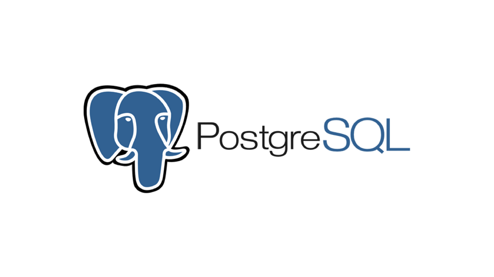

# PostgreSQL DB

> **完美的PG数据库，从这里开始！**



## 0. 章节目录

- [1.容器的基本使用](https://github.com/EscapeLife/awesome-builder/blob/master/dockerfiles/postgresql/README.md#1-%E5%AE%B9%E5%99%A8%E7%9A%84%E5%9F%BA%E6%9C%AC%E4%BD%BF%E7%94%A8)
- [2.主从的同步步骤](https://github.com/EscapeLife/awesome-builder/blob/master/dockerfiles/postgresql/README.md#2-%E4%B8%BB%E4%BB%8E%E7%9A%84%E5%90%8C%E6%AD%A5%E6%AD%A5%E9%AA%A4)
- [3.增量恢复和重建](https://github.com/EscapeLife/awesome-builder/blob/master/dockerfiles/postgresql/README.md#3-%E5%A2%9E%E9%87%8F%E6%81%A2%E5%A4%8D%E5%92%8C%E9%87%8D%E5%BB%BA)
- [4.功能示例的说明]()
- [5.现存的问题记录]()

## 1. 容器的基本使用

> **主要介绍postgres_es容器的基本使用方式和方法**

- **build**

```bash
# build postgres_es image
$ cd dockerfiles/postgresql
$ docker build --squash --no-cache --tag=postgres_es:latest .
```

- **docker**

```bash
# docker run postgres_es
docker run -d --name=postgres_es \
    -v ./postgres:/data \
    -p 5432:5432 \
    -e POSTGRES_DB=app \
    -e POSTGRES_PASSWORD=123456 \
    --network=postgres_es_network \
    postgres_es:latest
```


- **compose**

```yaml
# postgres_es compose yml
version: "3.7"

services:
  postgres:
    restart: on-failure
    container_name: postgres_es
    image: postgres_es:latest
    volumes:
      - "./postgres:/data"
    environment:
      - DEBUG=false
      - POSTGRES_DB=app
      - POSTGRES_PASSWORD=123456
    networks:
      - postgres_es_network

networks:
  postgres_es_network:
```

## 2. 主从的同步步骤

> **postgres_es镜像数据主从(master/slave)使用方法说明**

### 2.1 主从节点模式启动方式(master/slave)

- 当使用镜像启动 `master/slave` 模式时，启动的 `container` 容器必须先设置 `POSTGRES_ROLE` 环境变量用来表示节点的所属类型。其中，值为 `master` 表示主节点，值为 `slave` 表示丛节点。

```bash
# 主节点启动(master)
$ docker run -d --name container_name -e POSTGRES_ROLE='master' <other directive>

# 从节点启动(slave)
$ docker run -d --name container_name -e POSTGRES_ROLE='slave' <other directive>
```

### 2.2 主节点的配置(master)

- **以下两种情况之一，则需要配置其他环境变量**
  - [情况一] 当 master 节点和 slave 节点不再同一台物理机
  - [情况二] 当启动 container 设置的 ip 不是默认的 172.17.0.0/24 网段
- **配置 SLAVE_HOST_IP 环境变量**

```bash
# master
$ docker run -d --name container_name -e SLAVE_HOST_IP='ip' <other directive>
```

### 2.3 从节点的配置(slave)

- **以下两种情况之一，则需要配置其他环境变量**
  - [情况一] 当 master 节点和 slave 节点不再同一台物理机
  - [情况二] 当启动 container 设置的 ip 不是默认的 172.17.0.0/24 网段
- **配置 MASTER_HOST_IP 环境变量**

```bash
# slave
$ docker run -d --name container_name -e MASTER_HOST_IP='ip' <other directive>
```

### 2.4 安装 pgpool2 中间件

- **使用USE_PGPOOL环境变量控制是否安装pgpool2中间件**
  - 当需要在容器中安装 pgpool2 中间件时，启动 container 时设置 USE_PGPOOL 环境变量，值为 true。

```bash
# 当需要在容器中安装pgpool2中间件时，启动容器时设置USE_PGPOOL环境变量，值为true表示开启
$ docker run -d --name container_name -e USE_PGPOOL='true' <other directive>
```

- **以下情况需要在安装中间件时配置参数**
  - 当 master 节点和 slave 节点不再同一台物理机
  - master 和 slave 镜像默认地址不是 172.17.0.2 和 172.17.0.3
  - 数据库的映射端口不在默认的 5432 端口

```bash
# 配置内容: port没有变化(默认5432)的时候不用配置
$ docker run -d --name container_name \
    -e MASTER_HOST_IP='ip' -e MASTER_PG_PORT='port' \
    -e SLAVE_HOST_IP='ip' -e SLAVE_PG_PORT='port' <other directive>
```

### 2.5 整体使用示例(all)

> **以下使用主从数据库的完整配置**

- **主节点配置(master)**

```bash
$ docker run -d --name postgres_es_master -p 5432:5432 \
    -e POSTGRES_ROLE='master' -e USE_PGPOOL='true' \
    -e MASTER_HOST_IP='192.168.31.100' -e "MASTER_PG_PORT=5432" \
    -e SLAVE_HOST_IP='192.168.31.200' -e "SLAVE_PG_PORT=5432" \
    postgres_es:latest
```

- **从节点配置(slave)**

```bash
$ docker run -d --name postgres_es_slave -p 5432:5432 \
    -e POSTGRES_ROLE='slave' -e USE_PGPOOL='true' \
    -e MASTER_HOST_IP='192.168.31.100' -e "MASTER_PG_PORT=5432" \
    -e SLAVE_HOST_IP='192.168.31.200' -e "SLAVE_PG_PORT=5432" \
    postgres_es:latest
```

- 启动方式中可能传入环境变量较多，建议将多个环境变量定义在 `env` 文件中，在容器启动的时候传入，以便信息保存。

```bash
# use env file
$ docker run -d -p 5432:5432 --name postgres_es_master \
    --env-file file_path/env.conf postgres_es:latest
```

- 当使用 `pgpool` 作为应用链接数据库的中间件时，需要映射 `9999` 端口到宿主机，使用 `pgpool` 有以下好处。
  - 提高 `select` 操作的负载均衡（高并发操作时显著)
  - 增加连接池，提高连接的复用
  - 后端节点的 `failover` 主备节点切换后对应用影响小

## 3. 增量恢复和重建

> **数据库 WAL 增量方式的数据恢复和数据重建**
>
> - **WAL 恢复只支持单机模式**
> - **WAL 重建只支持单机模式**

- **环境变量说明**

| 参数编号 | 参数名称               | 含义说明                                                                                         |
| ------ | ---------------------- | -------------------------------------------------------------------------------------------- |
| 1      | `RECOVERY_TARGET_TIME` | 修改recovery.conf文件的recovery_target_time字段，配置格式如`2020-02-07 17:27:08 UTC`所示即可，需要注意的是容器内时区为UTC |
| 2      | `SKIP_BACKUP`          | 当该字段被设定时，会自动跳过备份，备份数据存放在 `/data/backup_xxxxxxxx` 目录内                                      |

### 3.1 增量 WAL 恢复数据

```bash
# PG服务暂停并执行如下操作
$ docker run -it --entrypoint=pg_wal_recovery.sh postgres_es:latest

# 恢复数据
$ docker exec -it <postgres_pd_id> pg_wal_recovery.sh

# 重新启动数据库
$ docker run or docker-compose
```

### 3.2 增量 WAL 重建数据

```bash
# PG服务暂停并执行如下操作
$ docker run -it --entrypoint=pg_wal_rebase.sh postgres_es:latest

# 重建数据
$ docker exec -it postgres_pd pg_wal_rebase.sh

# 重新启动数据库服务
$ docker run or docker-compose
```

## 4. 功能示例的说明

> **主要介绍新增的功能和启动、使用方式**

```bash
# 可以运行为non-root模式
# 需要-v的目录"owner uid"和启动传的"owner uid"一致
docker run -d --name=postgres_es \
    -v ./postgres:/data \
    -p 5432:5432 \
    -e POSTGRES_DB=app \
    -e POSTGRES_PASSWORD=123456 \
    -u 10086:10086 \
    --network=postgres_es_network \
    postgres_es:latest
```

## 5. 现存的问题记录

> **记录使用当中存在或者缺陷的问题**

当 `master` 节点 `down` 掉以后 `pgpool` 会进行一次主备切换。等角色恢复以后，需要重启一次 `pgpool` 服务才能让以后的 `failover_command` 有效执行。`pgpool2` 的在进行故障转移是，会先杀死所有的子进程，然后调用 `failover_command` 命令执行完成后再启动新的子进程接收客户端请求。测试中发现，执行 `failover_command` 的时获取了 `%d`、`%H` 进行判断节点和执行服务器，但是因为脚本不能有效获取两个值导致执行失败，使得 `pgpool` 子进程没有启动，使其功能失效。临时解决办法，根据部署节点，为 `failover_command` 的脚本传递明确的参数进行判断，不过该方法并不十分有效。
